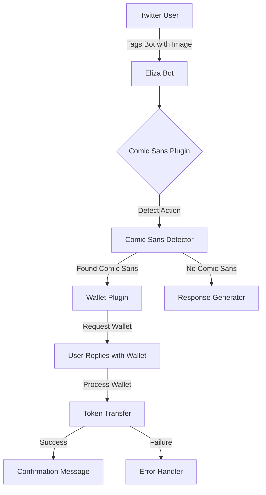

# Comic Sans Agent - Eliza Bot Extension

A Twitter bot that detects Comic Sans in images and rewards users with $COMICSANS tokens on Base network.

## Architecture Overview



## Plugin Architecture

### 1. Comic Sans Plugin (`src/plugins/comic-sans/`)
- Main detection and reward logic
- Components:
  - `index.ts`: Plugin registration
  - `action.ts`: Comic Sans detection action
  - `messages.ts`: Response generation

### 2. Wallet Plugin (`src/plugins/wallet/`)
- Handles wallet operations and token transfers
- Components:
  - `index.ts`: Plugin registration
  - `action.ts`: Wallet processing action

### 3. Comic Agent Plugin (`src/plugins/comic-agent/`)
- High-level coordination between plugins
- Manages state and user interactions

## Key Features

### 1. Comic Sans Detection
- Python-based font detection script
- OCR and font comparison
- Integrated with Node.js through utility functions

### 2. Token Rewards System
- Base network integration for $COMICSANS tokens
- Automated wallet validation and transfers
- Gas estimation and transaction management

### 3. State Management
- User interaction tracking
- Double-claim prevention
- Automatic cleanup of unclaimed requests

## Setup

### Prerequisites
- Python 3.x
- Node.js
- Tesseract OCR

### Installation
```bash
# Clone the repository
git clone <repository-url>

# Run the setup
make all
```

The Makefile handles:
- System dependency checks
- Python virtual environment setup
- Node.js dependencies
- Twitter client patching
- Environment configuration

## Environment Variables
Required environment variables:
```bash
# Twitter Configuration
TWITTER_COOKIES=[{"key":"auth_token","value":"YOUR_AUTH_TOKEN"},{"key":"ct0","value":"YOUR_CT0"}]
TWITTER_USERNAME=your_bot_username
TWITTER_PASSWORD=mock_password
TWITTER_EMAIL=mock@example.com

# Base Network Configuration
BASE_WALLET_PK=your_private_key
BASE_RPC_URL=https://mainnet.base.org
```

## Token Contract
- Network: Base
- Contract: 0x00Ef6220B7e28E890a5A265D82589e072564Cc57
- Standard: ERC20

## Development Commands
```bash
# Full setup
make all

# Check dependencies
make check-deps

# Clean installation
make clean

# Show help
make help
```

## Performance Optimizations
- Optimized image processing pipeline
- RPC fallback mechanisms
- Rate limiting implementation
- Efficient state management

## Security Features
- Wallet address validation
- Transaction timeout handling
- Rate limiting for API calls
- Error handling for failed transactions